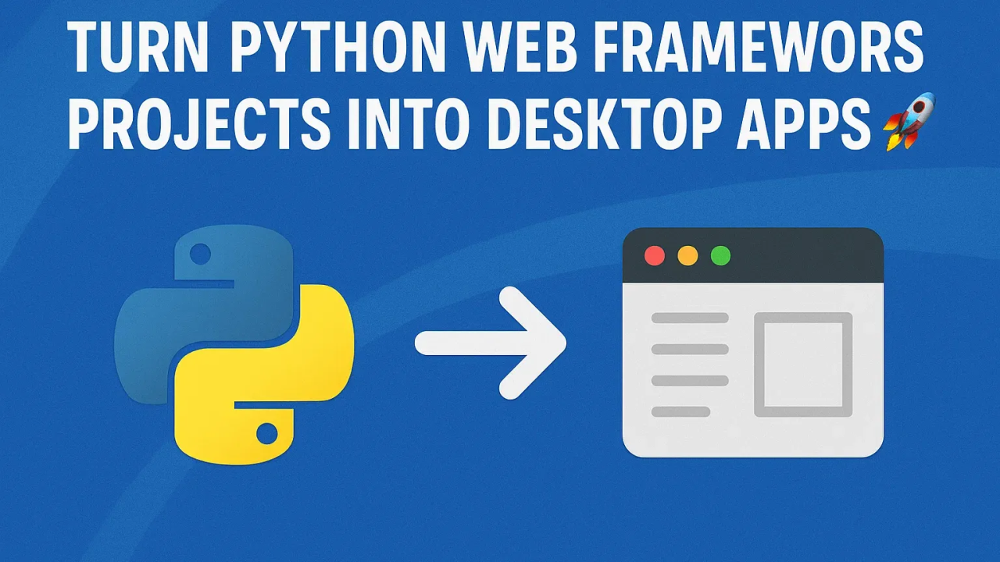
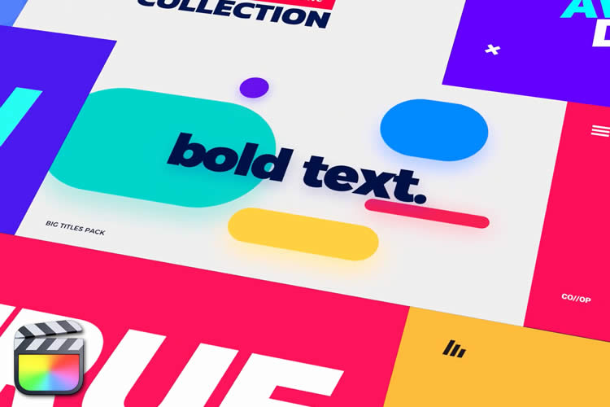

When I first began exploring creativity, I was drawn to design — not just how it looks, but how it makes us think, question, and interact. Back then, I thought design was part of technology but had nothing to do with the distributed systems and client devices I was studying. It felt like two completely different worlds.

But as I dove deeper into software engineering, I realized that design is everywhere — in the way we structure code, in user interfaces, in system architecture, and even in the tools we build. The connection between design and technology isn’t just real; it’s essential.

Today, I see software engineering as an art form. A good piece of software makes you curious. It invites you to explore and challenges you to think beyond the surface. It’s where usability meets creativity.

I’ve now started taking more focused steps in this journey — not just through courses or projects, but by working on real tools that bring this idea to life. Recently, I found a tool that perfectly represents this balance between web design, simplicity, and engineering: **gui-web**.

My journey is still unfolding. Every tool I use, every project I build, is fuel to keep this fire burning.

---

## A Step Forward: gui-web

<!--  -->

Recently, I came across a powerful open-source tool that perfectly aligns with this intersection of design, software engineering, and user experience: **gui-web**.

🔗 GitHub Repo: [github.com/mammhoud/gui-web](https://github.com/mammhoud/gui-web)  
📦 Install via pip:
```bash
pip install git+https://github.com/mammhoud/gui-web
````

### 🌟 What is gui-web?

**gui-web** is a lightweight Python tool that allows you to run your Flask, FastAPI, or Django web applications as **desktop applications** without the need for Electron or the licensing concerns of PyQt5. It simply wraps your app inside a browser window to give you a native desktop experience — no extra frameworks required.

### 🚀 Key Advantages

✅ No additional GUI libraries like PyQt5
✅ No learning curve if you already know Flask, Django, or FastAPI
✅ Simple browser-based window for a desktop feel
✅ Easy YAML-based configuration
✅ Compatible with PyInstaller, PyVan, and other packaging tools

---

### ⚙️ Minimal Django Setup with gui-web

If you’re using Django, setup is minimal and straightforward.

#### 1. Create `gui.py` next to `manage.py`

```python
from web_gui import main
main()
```

#### 2. Add `settings.yaml` in the same directory

```yaml
default:
  server: "django"
  app: "wsgi.application"
  port: 3003
  width: 1020
  height: 720
  fullscreen: true
  app_mode: true
  exit_after: null
  on_shutdown: shutdown_handler.clean_up
```

#### 3. Run the Desktop App

```bash
python gui.py
```

---

### 🔧 Custom Shutdown Handling

You can add callable functions in `settings.yaml` to handle cleanup tasks before the app shuts down.

Example Python callable:

```python
# django_project/shutdown_handler.py
import time

def clean_up():
    print("Cleaning up resources...")
    time.sleep(5)
    print("Cleanup complete.")
```

Configuration:

```yaml
on_shutdown: shutdown_handler.clean_up
```

---

### 📂 Configuration File Locations

* `gui.py`: Same directory as `manage.py`
* `settings.yaml`: Same directory as `gui.py`

---

### 🌟 Perfect For:

* Internal tools and dashboards
* Lightweight web apps as desktop solutions
* Rapid prototypes and demos
* Cross-platform desktop wrappers

---

### 📢 Final Thoughts

**gui-web** is a simple solution for developers who want to bring their web apps to the desktop — no heavy layers, just Python and your existing framework.

If you’re building internal tools or need fast desktop delivery, this is definitely worth exploring.

👉 Check out the project: [github.com/mammhoud/gui-web](https://github.com/mammhoud/gui-web)