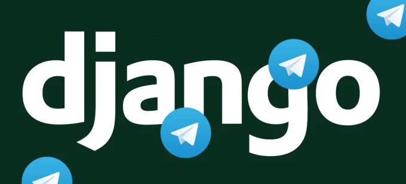

The Multi Usage Chatbot is an AI-powered chatbot developed using **Python** and **Rasa** with a **multi-tenant architecture**. It is integrated with popular chat applications to automatically handle user inquiries and conduct feedback surveys.

### Key Features:
- Multi-tenant support for simultaneous client handling.
- Real-time synchronization with chat applications.
- Integrated feedback survey system.
- Dockerized deployment for easy scalability.

### Technologies Used:
- Python
- Rasa (Open-source conversational AI)
- Web-Hook
- Docker

### Project Highlights:
- Developed to support large-scale chatbot operations.
- Provides efficient user inquiry management.
- Designed for quick deployment using Docker containers.
<!-- 
### Source:
<a href="https://github.com/mammhoud"><i class="large github icon"></i>mammhoud</a> -->
