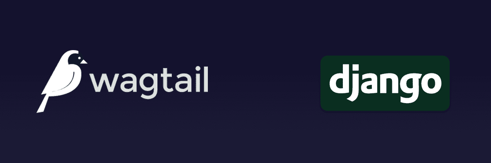

The **Content Driven Website Builder** is a custom CMS developed using **Django** and **Wagtail** that enables businesses to display dynamic content and manage their website with real-time updates.

The system includes advanced form customization, user role management, and dynamic page design directly from the admin panel.

### Key Features:
- Dynamic content updates via the admin dashboard.
- User role and permission management.
- Flexible and customizable web forms.
- Real-time page design changes without developer intervention.

### Technologies Used:
- Python
- Django
- Wagtail
- SQL
- HTML
- CSS
- JavaScript

### Project Highlights:
- Delivered a highly adaptable CMS tailored for business needs.
- Enabled non-technical users to update content easily.
- Integrated advanced user permissions to manage editing rights securely.

<!-- ### Source:
<a href="https://github.com/mammhoud"><i class="large github icon"></i>mammhoud</a> -->
